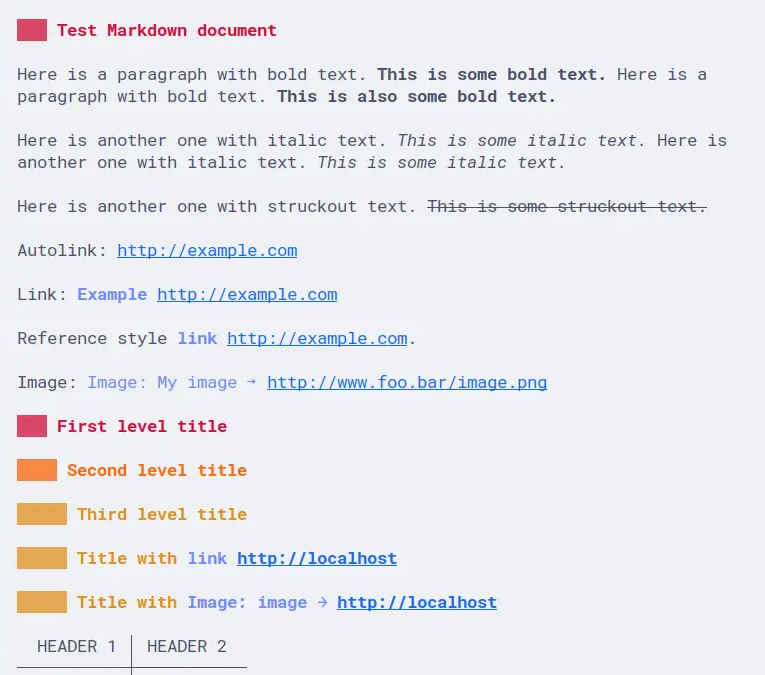
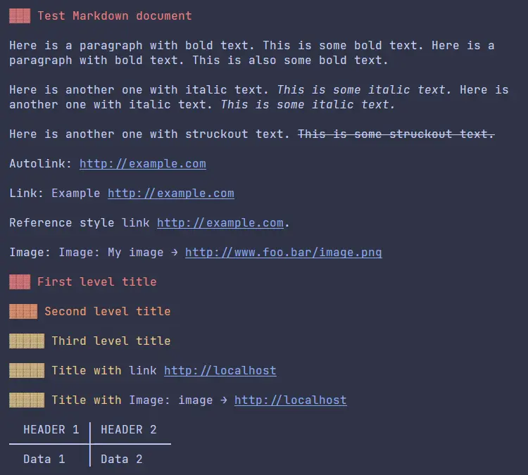
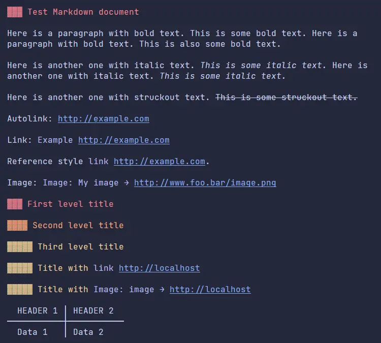
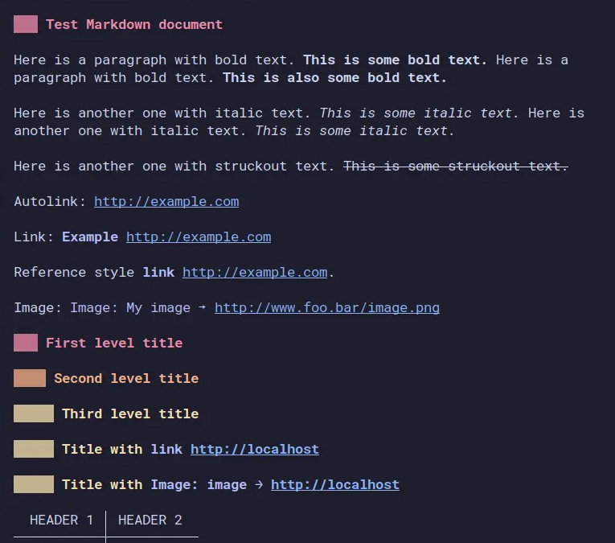

<h3 align="center">
	 
	
	Catppuccin for <a href="https://github.com/charmbracelet/glamour">Glamour</a>
	
</h3>

	
	
	

	

## Previews

🌻 Latte

  

🪴 Frappé

  

🌺 Macchiato

  

🌿 Mocha

  

## Usage

1. Clone this repository to a desired directory
2. Pick a flavour of your choice
3. Read the documentation for the program in which you want to use the theme in
4. Enjoy!

## Supported Programs

> If you find any more applications that support Glamour, feel free to open an issue or PR!

- [slides](https://github.com/maaslalani/slides)
- [glow](https://github.com/charmbracelet/glow)
- [meteor](https://github.com/odpf/meteor)
- [glab](https://gitlab.com/gitlab-org/cli)
- [fm](https://github.com/knipferrc/fm)
- [GitHub CLI](https://github.com/cli/cli)

## 👐 Contributing

To create the json files run `python src/generate.py`.
You may need to run `pip install -r reqirements.txt` ig you don't already have all the dependencies installed.

## 💝 Thanks to

- [Dukeatron](https://github.com/Dukeatron)
- [justTOBBI](https://github.com/justTOBBI)
- [extremepayne](https://github.com/extremepayne)

&nbsp;

	

	Copyright &copy; 2021-present <a href="https://github.com/catppuccin" target="_blank">Catppuccin Org</a>

	

